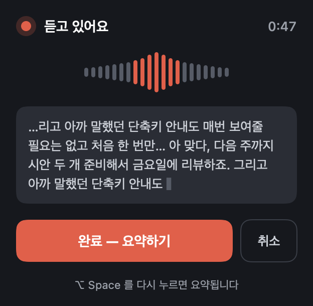
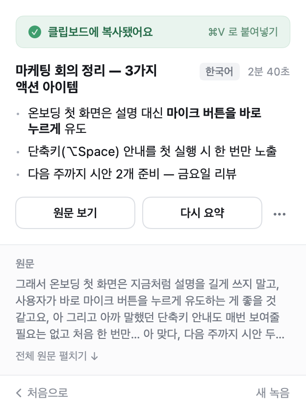
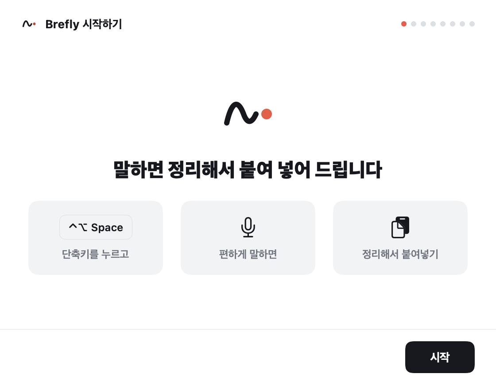
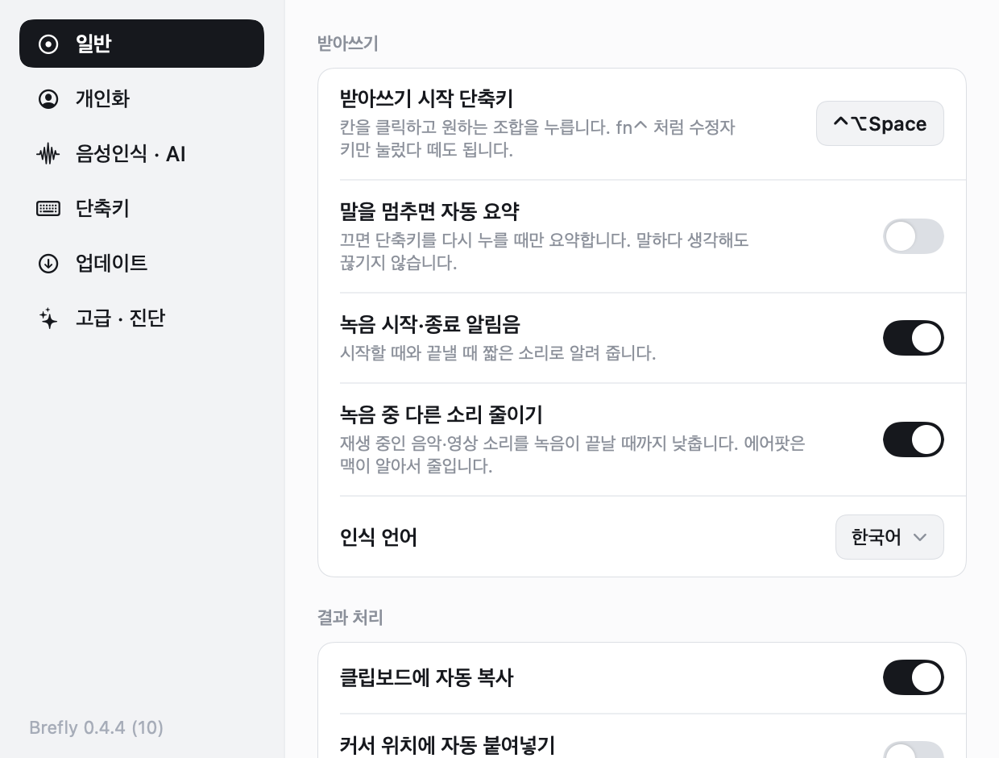

<div align="center">


<br>

<p>
  <a href="https://github.com/yunuchoiii/brefly/releases/latest/download/Brefly.dmg"></a>
  <a href="https://yunuchoiii.github.io/brefly-pages/"></a>
  <a href="https://github.com/sponsors/yunuchoiii"></a>
</p>

<p>
  
  
  
  <a href="https://github.com/yunuchoiii/brefly/releases"></a>
</p>

</div>

<br>

```
단축키 → 말하기 → 단축키 → AI 정리 → 클립보드 복사 (또는 커서 위치에 자동 붙여넣기)
```

**Brefly**(브레플리)는 macOS 메뉴바에서 도는 음성 받아쓰기·AI 정리 앱입니다.

받아쓰기는 macOS 에 내장된 애플 음성 인식을 씁니다. 돈이 들거나 키가 필요한 건 "AI 정리" 단계뿐이고,
그것도 **무료 Gemini 키**나 **macOS 26 의 Apple Intelligence** 로 무료로 쓸 수 있습니다. Claude 는 선택 사항입니다.

<br>

## 화면

<table>
<tr>
<td width="50%" valign="top">

**말하는 중** — 실시간 파형과 받아쓴 글



</td>
<td width="50%" valign="top">

**정리 끝** — 클립보드에 복사, 원문도 확인



</td>
</tr>
<tr>
<td width="50%" valign="top">

**처음 설정** — 권한을 한 화면에 하나씩



</td>
<td width="50%" valign="top">

**설정** — 단축키·AI 모델·말투를 취향대로



</td>
</tr>
</table>

<br>

## 설치

1. 위 **다운로드** 버튼으로 `Brefly.dmg` 를 받아 엽니다.
2. Brefly 를 **Applications** 폴더로 끌어 넣고 실행합니다. 애플 공증을 받은 앱이라 경고 없이 열립니다.
3. 처음 실행하면 설치 안내가 열립니다. **마이크**와 **음성 인식** 권한을 한 단계씩 허용합니다.
4. **시스템 설정 > 키보드 > 받아쓰기**를 켜고 언어에 한국어를 추가합니다.
   이 스위치가 꺼져 있으면 인식이 아예 되지 않습니다. 안내가 자동으로 확인해 줍니다.
5. 주로 쓰는 분야를 고릅니다. 그 분야 용어를 더 정확히 알아듣습니다.

메뉴바에 파형 아이콘이 생기면 준비 끝입니다.

<br>

## 사용법

| 하는 일 | 방법 |
|---|---|
| 녹음 시작·종료 | **⌃⌥Space** (설정에서 변경, `fn⌃` 처럼 수정자 키만도 가능) |
| 녹음 취소 | **Esc** |
| 결과 붙여넣기 | ⌘V. 설정에서 "커서 위치에 자동 붙여넣기"를 켜면 알아서 들어갑니다 |
| 지난 기록 보기 | 메뉴바 아이콘 클릭 |
| 새 버전 확인 | 설정 > 업데이트. 하루 한 번 자동으로도 확인합니다 |

- 말을 멈추면 알아서 끝내게 하려면 설정 > 일반 > "말을 멈추면 자동 요약"을 켭니다.
- 녹음 중에는 재생 중인 음악·영상 소리를 낮춥니다.
- AI 정리가 실패해도 말한 내용은 사라지지 않습니다. 원문이 복사되고 "다시 요약" 버튼이 나옵니다.

<br>

## AI 모델 고르기

설정 > **음성인식 · AI**. 받아쓰기 자체는 어느 쪽을 골라도 무료입니다.

| 선택 | 필요한 것 | 비용 | 속도 |
|---|---|---|---|
| **AUTO** (기본) | Gemini 무료 키. macOS 26 + Apple Intelligence 면 둘을 같이 돌려 나은 쪽을 씀 | 무료 | 1~5초 |
| Apple AI (이 맥) | macOS 26 + Apple Intelligence | 무료, 인터넷 불필요 | 1~2초 |
| Gemini | [Google AI Studio](https://aistudio.google.com/apikey) 무료 키 (카드 등록 불필요) | 무료 | 1~5초 |
| Claude API | Anthropic 키 + 크레딧 | 한 번에 4원 안팎 | 1초 안팎 |
| Claude Code | Claude 구독 + 터미널 로그인 | 구독 사용량 | 10~60초 |
| AI 정리 끄기 | 없음 | 무료 | 받아쓰기 원문 그대로 |

**가장 쉬운 길**은 Gemini 무료 키입니다. 설정의 **?** 버튼에 발급 순서가 있고, 키는 이 맥의 본인 계정만 읽을 수 있는 파일에 저장됩니다.

<br>

## 설정 창

| 탭 | 있는 것 |
|---|---|
| 일반 | 단축키, 자동 요약, 인식 언어, 알림음, 소리 줄이기, 클립보드·자동 붙여넣기, Dock 표시 |
| 개인화 | 주로 쓰는 분야, 내 소개, 추가 용어, 화면 모드 |
| 음성인식 · AI | 애플 서버 인식 여부, AI 모델, 정리 스타일, API 키 |
| 단축키 | 직접 녹음 또는 프리셋 |
| 업데이트 | 새 버전 확인, 바뀐 점 보기, 자동 확인 |
| 고급 · 진단 | 상태 진단, AI 연결 테스트, 붙여넣기 테스트, 로그 열기 |

<br>

## 안 될 때

설정 > 고급 · 진단의 **현재 상태 진단**이 권한·언어·키 상태를 한 화면에 보여 줍니다.

| 증상 | 확인할 것 |
|---|---|
| 말했는데 아무것도 안 나옴 | 시스템 설정 > 키보드 > 받아쓰기가 켜져 있는지, 마이크 권한 |
| 잘 못 알아들음 | 설정 > 음성인식 · AI 에서 "애플 서버에서 처리"가 켜져 있는지 |
| 원문은 나오는데 정리가 안 됨 | AI 모델 연결 테스트. Gemini 는 저녁에 실패가 잦습니다 |
| 클립보드에만 복사되고 안 붙여짐 | 손쉬운 사용 권한 |

로그는 `~/Library/Logs/Brefly.log` 에 남습니다.

<br>

## 개인정보

- 음성은 애플 음성 인식으로 처리합니다. 기본은 애플 서버 인식(더 정확)이고, 끄면 인터넷 없이 이 맥 안에서만 인식합니다.
- 받아 적은 텍스트는 고른 AI 모델에만 전송됩니다. Apple AI 를 고르면 아무 데도 보내지 않습니다.
- 요약 기록은 이 맥에만 저장됩니다.

<br>

## 후원

무료 앱입니다. 도움이 됐다면 커피 한 잔으로 응원해 주세요.

<a href="https://github.com/sponsors/yunuchoiii"></a>

<br>

---

<br>

# 개발자용

Xcode 프로젝트 없이 `swiftc` 로 빌드합니다. 명령줄 도구만 있으면 됩니다.

```bash
xcode-select --install      # 이미 있으면 건너뜀
./build.sh                  # build/Brefly.app
./build.sh --install        # /Applications 에 설치하고 실행
open build/Brefly.app       # 터미널에서 실행 파일을 직접 돌리면 권한 주체가 터미널이 되어 붙여넣기가 안 됨
```

작업 규칙과 구조에서 안 보이는 결정은 [CLAUDE.md](CLAUDE.md) 에 있습니다.

## 검증

```bash
build/Brefly.app/Contents/MacOS/Brefly --render-previews /tmp/previews   # 팝오버·설정 창 각 상태를 PNG 로
build/Brefly.app/Contents/MacOS/Brefly --polish "어 그 테스트 입니다"      # 녹음 없이 정리만
build/Brefly.app/Contents/MacOS/Brefly --check-update 0.1.0              # 업데이트 확인 판정
tail -f ~/Library/Logs/Brefly.log                                        # "자동 모드: ○○ 채택 (n초)"
```

## 배포

```bash
./make-dmg.sh               # 빌드 → DMG → Developer ID 서명 → 공증 → 스테이플
```

Developer ID Application 인증서와 notarytool 프로필(`brefly` 또는 이름 바꾸기 전의 `sokki`)이 있는 맥에서만 공증됩니다. 순서: Info.plist 버전 올림 →
`make-dmg.sh` → dev→main PR → 머지 **후** 태그 → `gh release create vX.Y.Z build/Brefly-X.Y.Z.dmg build/Brefly.dmg` →
`gh workflow run pages.yml -R yunuchoiii/brefly-pages`.

## 구조

```
Sources/
  main.swift            앱 진입, 상태 머신, 팝오버·Dock·메뉴, 침묵 감지, 진단
  PopoverView.swift     팝오버 화면 (대기 / 녹음 중 / 정리 중 / 완료 / 기록 / 오류)
  AppModel.swift        팝오버가 관찰하는 상태와 동작
  Onboarding.swift      첫 실행 설치 안내 (권한을 한 화면에 하나씩)
  SettingsWindow.swift  설정 창 6개 탭
  SpeechRecorder.swift  마이크 탭 + 실시간 인식, 구간 누적
  ClaudeClient.swift    정리 프롬프트·말투 감지, AI 모델 분기, Anthropic API
  GeminiClient.swift    Google AI Studio (모델 겹쳐 쏘기, 폴백)
  AppleClient.swift     macOS 26 온디바이스 모델 (약한 링크)
  UpdateChecker.swift   GitHub 릴리스와 버전 비교
  AudioDucker.swift     녹음 중 다른 소리 낮추기
  Chime.swift           시작·종료 알림음 합성
  HotKey.swift          전역 핫키 + 수정자 전용 핫키
  Paster.swift          클립보드 백업 → 주입 → ⌘V → 복원
  Prefs.swift           설정, API 키 파일, 이름 변경 이전
  Theme.swift           팔레트, 로고 벡터
```

동작 흐름:

```
전역 핫키 → AVAudioEngine 마이크 탭 → SFSpeechRecognizer (부분 결과 스트리밍)
  → 핫키 다시 → 최종 원문 → Glossary.apply(용어 치환) → Polisher (AUTO: Apple 온디바이스 ∥ Gemini)
  → 클립보드 복사 / NSPasteboard 주입 → ⌘V 합성 → 클립보드 복원
```

## 알아 둘 점

- 애플 서버 인식은 한 번에 약 1분 제한이 있습니다. 온디바이스는 제한이 없지만 정확도가 떨어집니다.
- 애드혹 서명 빌드는 재빌드마다 접근성 권한이 풀릴 수 있습니다. `./build.sh --install --reset-perms`.
- 번들 ID 는 `com.brefly.dictation`. 바꾸면 권한과 설정이 초기화됩니다(Sokgi→Sokki→Brefly 이전 코드 있음).
